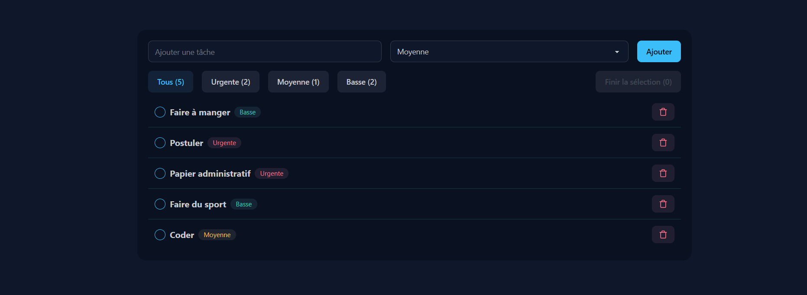

# Modern Todo List

Une application de gestion de tâches moderne, développée avec React et TypeScript.

## Fonctionnalités

- Ajout de tâches avec texte et priorité (Urgente, Moyenne, Basse)
- Filtrage des tâches par priorité ou affichage de toutes
- Suppression individuelle des tâches
- Sélection multiple et suppression groupée ("Finir la sélection")
- Sauvegarde automatique des tâches dans le navigateur (localStorage)
- Interface responsive et design épuré

## Installation

1. Clone le projet :
   ```sh
   git clone https://github.com/ton-utilisateur/nom-du-repo.git
   ```
2. Installe les dépendances :
   ```sh
   npm install
   ```
3. Lance l’application :
   ```sh
   npm start
   ```

## Aperçu



## Technologies

- React
- TypeScript
- Tailwind CSS (ou autre framework CSS utilisé)
- Icônes Lucide